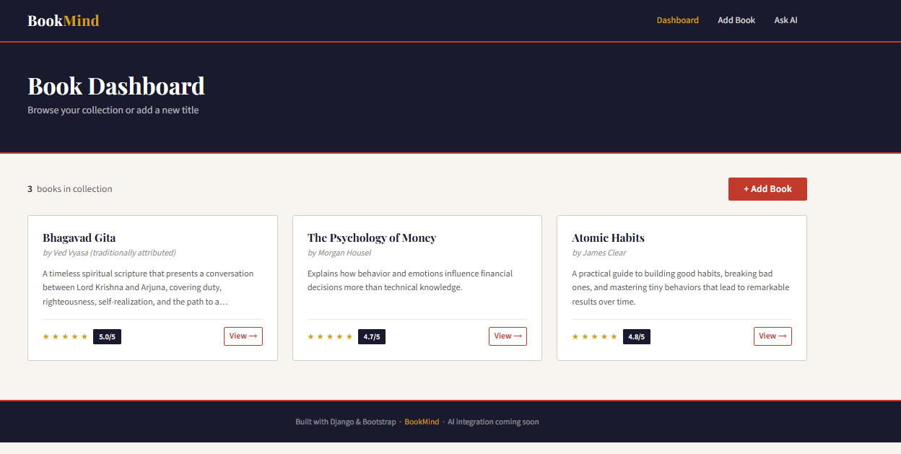
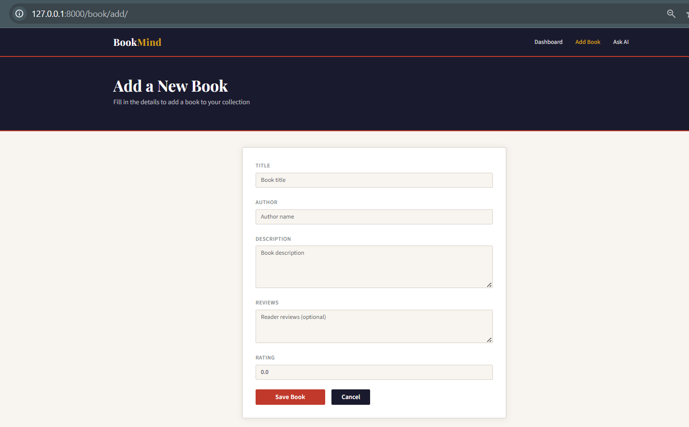

# 📚 BookMind — AI-Powered Book Recommendation System

A production-ready Django-based Book Recommendation and Q&A system leveraging TF-IDF vectorization, cosine similarity, and a RAG-inspired architecture for intelligent book discovery and semantic querying.

🌐 **Live Demo (MVP):** https://bookmind-zu6u.onrender.com/

> Designed with a modular architecture enabling seamless integration of LLM APIs (OpenAI / Hugging Face) for future semantic search and Q&A capabilities.

## Tech Stack

| Layer            | Technology                              |
|------------------|------------------------------------------|
| Backend          | Django 4.2 (Python)                     |
| Database         | SQLite (default) / MySQL (configurable) |
| Frontend         | Django Templates + Bootstrap 5          |
| Env Management   | python-dotenv                           |
| ML / NLP         | scikit-learn (TF-IDF, Cosine Similarity)|
| AI Integration   | OpenAI API (optional with fallback)     |
| Future Upgrade   | ChromaDB, sentence-transformers         |

---

## Features

- 📖 Dynamic book dashboard with database-driven rendering  
- ➕ Add and manage books with validated Django forms  
- 🔍 Detailed book view including metadata (description, reviews, rating)  
- 🤖 Intelligent query system using semantic similarity (TF-IDF + cosine similarity)  
- 🔢 Dynamic top-N recommendations extracted from natural language queries  
- 🧠 RAG-inspired pipeline (retrieval + optional LLM generation with fallback)  
- ⚠️ Robust error handling for API failures (graceful fallback to rule-based output)  
- 🛠 Django Admin panel for structured data management  

---

## 📸 Screenshots

## 📸 Screenshots

### 📊 Dashboard


### ➕ Add Book


### 🤖 Ask AI


---


## ⚙️ Architecture — How It Works

The system follows a lightweight Retrieval-Augmented Generation (RAG)-inspired pipeline combining traditional Information Retrieval (IR) techniques with optional LLM-based response generation.

### 🔄 Pipeline

1. **User Query Input**
   - Natural language query received via `/ask/`

2. **Text Aggregation**
   - Book metadata (title, author, description, reviews) is combined into a single textual representation

3. **Vectorization**
   - TF-IDF (scikit-learn) transforms text into numerical feature vectors

4. **Similarity Search**
   - Cosine similarity computes relevance between query and book vectors

5. **Top-K Retrieval**
   - Dynamic number of recommendations extracted from query using regex

6. **Response Generation (Optional)**
   - OpenAI API (LLM) generates contextual explanation  
   - Fallback returns ranked book recommendations
   
---

## Project Structure

```
book_recommender/
├── manage.py
├── requirements.txt
├── README.md
├── .env.example
├── config/
│   ├── __init__.py
│   ├── settings.py
│   ├── urls.py
│   └── wsgi.py
└── books/
    ├── __init__.py
    ├── models.py
    ├── views.py
    ├── urls.py
    ├── forms.py
    ├── admin.py
    ├── static/books/css/
    │   └── style.css
    └── templates/books/
        ├── base.html
        ├── book_list.html
        ├── book_detail.html
        ├── add_book.html
        └── ask.html
```

---

## Setup Instructions

### Prerequisites

- Python 3.10+
- MySQL 8.0+
- pip

---

### Step 1 — Clone the repository

```bash
git clone <your-repo-url>
cd book_recommender
```

### Step 2 — Create and activate a virtual environment

```bash
python -m venv venv

# macOS / Linux
source venv/bin/activate

# Windows
venv\Scripts\activate
```

### Step 3 — Install dependencies

```bash
pip install -r requirements.txt
```

### Step 4 — Configure environment variables

```bash
cp .env.example .env
```

Open `.env` and fill in your values:

```
SECRET_KEY=your-very-secret-key
DEBUG=True
DB_NAME=book_recommender_db
DB_USER=root
DB_PASSWORD=your_mysql_password
DB_HOST=localhost
DB_PORT=3306
```

### Step 5 — Create the MySQL database

Log in to MySQL and run:

```sql
CREATE DATABASE book_recommender_db
  CHARACTER SET utf8mb4
  COLLATE utf8mb4_unicode_ci;
```

### Step 6 — Run migrations

```bash
python manage.py makemigrations
python manage.py migrate
```

### Step 7 — (Optional) Create a superuser

```bash
python manage.py createsuperuser
```

### Step 8 — Start the development server

```bash
python manage.py runserver
```

Visit: **http://127.0.0.1:8000**

---

## URL Routes

| Endpoint        | View Function  | Description                                                                 |
|-----------------|----------------|-----------------------------------------------------------------------------|
| `/`             | `book_list`    | Displays all books with dynamic rendering from the database                |
| `/book/add/`    | `add_book`     | Form-based book creation with validation                                   |
| `/book/<pk>/`   | `book_detail`  | Detailed view of a selected book                                           |
| `/ask/`         | `ask_question` | Semantic query interface with TF-IDF similarity + dynamic recommendations  |
| `/admin/`       | Django Admin   | Built-in admin panel for managing data                                     |

---

## How to Run the Project

```bash
# Activate venv (if not already active)
source venv/bin/activate

# Start server
python manage.py runserver

# Access in browser
open http://127.0.0.1:8000
```

---

## Future Enhancements

The current system implements a lightweight semantic retrieval pipeline using TF-IDF vectorization and cosine similarity. The following enhancements can further evolve it into a full-scale production-grade RAG system:

| Feature                    | Technology / Approach              | Status        |
|---------------------------|-----------------------------------|--------------|
| Semantic embeddings       | TF-IDF (scikit-learn)             | Implemented ✅ |
| Similarity search         | Cosine similarity                 | Implemented ✅ |
| Dynamic top-N retrieval   | Regex-based query parsing         | Implemented ✅ |
| LLM-based response        | OpenAI API (with fallback)        | Integrated ⚠️ |
| Advanced embeddings       | sentence-transformers             | Planned       |
| Vector database           | ChromaDB / FAISS                  | Planned       |
| Full RAG pipeline         | LangChain / custom pipeline       | Planned       |
| Context-aware responses   | Prompt engineering + LLM          | Planned       |
| User authentication       | Django Auth                       | Planned       |
| Personalization           | User history + recommendation     | Planned       |


---

## License

MIT

---

## 👨‍💻 Author

**Avikal Singh**  
Backend Developer (Django | Python) • AI & Machine Learning Enthusiast  

- 🔧 Built: RAG-inspired Book Recommendation System using TF-IDF and Cosine Similarity  
- 💻 Focus: Backend Development, API Design, and AI Integration  
- 🤖 Exploring: Machine Learning, LLMs, and Semantic Search Systems  

- GitHub: [avikal07](https://github.com/avikal07)  
- LinkedIn: [Avikal Singh](https://linkedin.com/in/avikal-singh)